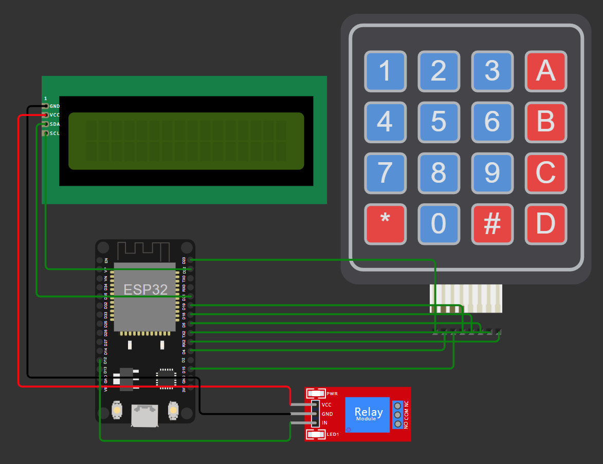

# sms-lock

Arduino Sketch for ESP32 controller for unlock by SMS project.

There is a list of secret codes hardcoded into ESP32 controller.
When user buy an item, the system (another one) send him one of the codes.
User enters the code by 16-buttons keyboard.
The controller checks the code exists and not used yet,
then unlock an item from the stack for the user.
It uses the relay.

